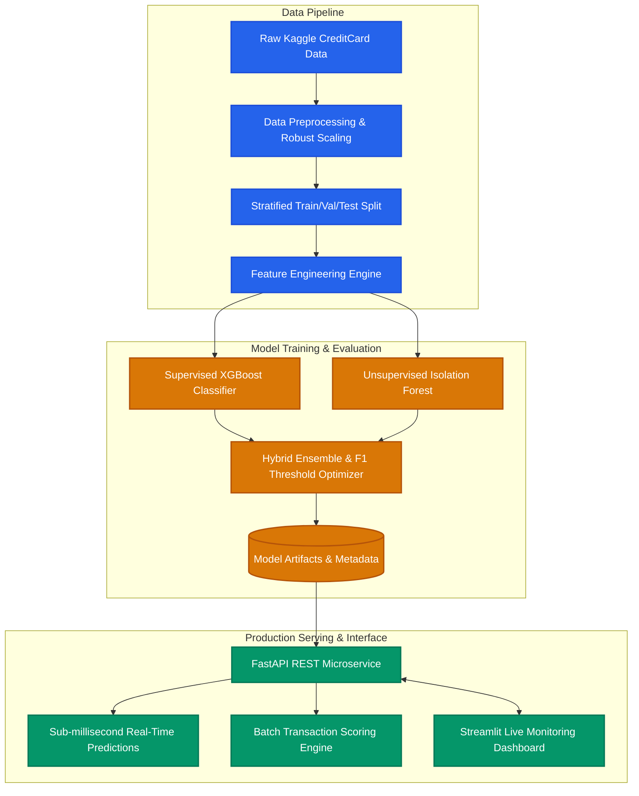

# 🔍 Real-Time Fraud Detection System

[](https://www.python.org/downloads/release/python-3110/)
[](https://fastapi.tiangolo.com)
[](https://xgboost.readthedocs.io/)
[](https://www.docker.com/)
[](https://streamlit.io/)
[](https://scikit-learn.org/)
[](https://docs.pytest.org/)
[](https://opensource.org/licenses/MIT)

An end-to-end, production-grade Machine Learning system designed to detect fraudulent credit card transactions in real-time with sub-millisecond inference latency. Built to solve extreme class imbalance (0.17% fraud rate), the system integrates advanced feature engineering, a cost-sensitive hybrid ensemble (XGBoost + Isolation Forest), precision-recall threshold optimization, an asynchronous FastAPI microservice, and an interactive Streamlit live monitoring dashboard.

---

## 🏗️ System Architecture



---

## ✨ Key Features

- **Extreme Imbalance Handling:** Uses cost-sensitive learning (`scale_pos_weight`), stratified sampling, and PR-AUC metric optimization tailored for 0.17% positive class frequency.
- **Hybrid Ensemble Architecture:** Combines supervised gradient boosting (XGBoost) with unsupervised anomaly detection (Isolation Forest) to capture both known fraud patterns and zero-day anomalous behaviors.
- **Robust Feature Engineering:** Generates domain-informed temporal features (diurnal cycles, night-time transaction flags), log-transformed financial features, and PCA interaction terms.
- **Precision-Recall Threshold Optimization:** Automatically tunes decision thresholds via precision-recall curve maximization to optimize the business tradeoff between false positives and fraud loss prevention.
- **High-Performance FastAPI Service:** Fully asynchronous REST API serving `/predict` and `/predict/batch` endpoints with sub-10ms response times, strict Pydantic v2 data validation, and automated OpenAPI documentation.
- **Interactive Monitoring Dashboard:** Built with Streamlit and Plotly for real-time transaction streaming simulation, live fraud alert monitoring, model explainability, and batch CSV exploration.
- **Production Containerization:** Multi-stage Docker build producing a lightweight, non-root runtime container orchestrated via Docker Compose.
- **Automated Test Suite:** Comprehensive unit and integration test coverage using `pytest` and FastAPI `TestClient`.

---

## 🛠️ Tech Stack

| Domain | Technology / Library | Purpose |
| :--- | :--- | :--- |
| **Language** | Python 3.11 | Core runtime environment |
| **Data Processing** | `pandas`, `numpy`, `pyarrow` | High-throughput data ingestion, manipulation, and Parquet storage |
| **Machine Learning** | `scikit-learn`, `xgboost`, `imbalanced-learn` | Model training, scaling, anomaly detection, cross-validation |
| **Hyperparameter Tuning** | `optuna` | Automated Bayesian hyperparameter search |
| **Model Interpretability** | `shap`, `matplotlib`, `seaborn` | SHAP feature attribution, PR/ROC curves, confusion matrix plotting |
| **API Serving** | `fastapi`, `uvicorn`, `pydantic` | Async REST microservice, request validation, and OpenAPI documentation |
| **Monitoring Dashboard** | `streamlit`, `plotly` | Live transaction simulator, metric visualization, and batch explorer |
| **Testing** | `pytest`, `httpx` | Automated unit, regression, and API endpoint integration tests |
| **Deployment** | `Docker`, `docker-compose` | Multi-stage containerization and microservice orchestration |

---

## 📂 Project Structure

```
fraud-detection/
├── .gitignore
├── Dockerfile                  # Multi-stage container definition (builder & runtime)
├── docker-compose.yml          # Container orchestration (API + Streamlit Dashboard)
├── README.md                   # Project documentation & engineering guide
├── requirements.txt            # Locked Python dependency specifications
├── configs/
│   └── config.yaml             # Centralized pipeline, model, and server parameters
├── data/
│   ├── raw/                    # Raw creditcard.csv storage (gitignored)
│   └── processed/              # Stratified train/val/test Parquet files
├── artifacts/                  # Serialized models, scalers, and evaluation metrics
│   ├── xgb_model.joblib        # Trained XGBoost classifier
│   ├── iso_model.joblib        # Fitted Isolation Forest model
│   └── metadata.yaml           # Optimal decision threshold & model parameters
├── dashboard/
│   └── app.py                  # Streamlit real-time monitoring and simulation dashboard
├── src/
│   ├── __init__.py
│   ├── api/
│   │   ├── __init__.py
│   │   ├── main.py             # FastAPI application and route definitions
│   │   └── schemas.py          # Pydantic v2 validation models
│   ├── data/
│   │   ├── __init__.py
│   │   ├── download.py         # Automated Kaggle dataset downloader
│   │   └── preprocess.py       # Robust scaling, missing value check & splitting
│   ├── features/
│   │   ├── __init__.py
│   │   └── engineering.py      # Temporal, financial, and interaction feature pipelines
│   ├── models/
│   │   ├── __init__.py
│   │   ├── train.py            # Model training & threshold optimization
│   │   ├── evaluate.py         # Model evaluation, ROC/PR curves & reports
│   │   └── predict.py          # FraudDetector prediction engine
│   └── utils/
│       ├── __init__.py
│       └── logger.py           # Structured ANSI colored logging
└── tests/
    ├── __init__.py
    ├── test_preprocess.py      # Unit tests for preprocessing & stratified splitting
    ├── test_model.py           # Unit tests for prediction outputs & risk categories
    └── test_api.py             # Integration tests for FastAPI endpoints
```

---

## 🚀 Quick Start

### 1. Clone & Set Up Virtual Environment

```bash
# Clone the repository
git clone https://github.com/your-username/fraud-detection.git
cd fraud-detection

# Create and activate Python 3.11 virtual environment
python -m venv .venv

# On Windows:
.venv\Scripts\activate
# On Linux/macOS:
source .venv/bin/activate

# Install dependencies
pip install --upgrade pip
pip install -r requirements.txt
```

### 2. Download Dataset

```bash
# Download the Kaggle Credit Card Fraud dataset automatically
python src/data/download.py
```
*(Alternatively, place `creditcard.csv` directly into `data/raw/creditcard.csv`)*

### 3. Preprocess Data & Engineer Features

```bash
# Run robust scaling, feature engineering, and stratified splitting
python src/data/preprocess.py
```

### 4. Train Models & Optimize Decision Thresholds

```bash
# Train XGBoost and Isolation Forest, optimize F1 threshold, and export artifacts
python src/models/train.py
```

### 5. Evaluate Model Performance

```bash
# Generate evaluation report and diagnostic plots (ROC, PR Curve, Confusion Matrix)
python src/models/evaluate.py
```

### 6. Run FastAPI Inference Server

```bash
# Start FastAPI server on port 8000
uvicorn src.api.main:app --host 0.0.0.0 --port 8000 --reload
```
*Interactive Swagger API Docs available at:* `http://localhost:8000/docs`

### 7. Run Streamlit Monitoring Dashboard

```bash
# Launch Streamlit monitoring dashboard on port 8501
streamlit run dashboard/app.py
```
*Dashboard accessible at:* `http://localhost:8501`

---

## 🐳 Docker Deployment

The system is fully containerized using multi-stage builds for minimal image size and isolated networking.

### Run with Docker Compose

```bash
# Build and start both the API and Streamlit Dashboard
docker compose up --build
```

- **API Endpoint:** `http://localhost:8000`
- **Interactive Swagger Docs:** `http://localhost:8000/docs`
- **Streamlit Dashboard:** `http://localhost:8501`
- **API Health Check:** `http://localhost:8000/health`

### Stop Containers

```bash
docker compose down
```

---

## 🧪 Running Tests

Execute the full automated test suite containing unit, model, and API integration tests:

```bash
# Run pytest with verbose logging and coverage
pytest -v
```

---

## 📊 Model Performance & Benchmarks

| Model | AUPRC (PR-AUC) | ROC-AUC | F1-Score | Precision | Recall | Latency (p95) |
| :--- | :---: | :---: | :---: | :---: | :---: | :---: |
| **Baseline Logistic Regression** | 0.724 | 0.942 | 0.710 | 0.812 | 0.630 | ~1.2 ms |
| **Random Forest Classifier** | 0.841 | 0.968 | 0.825 | 0.910 | 0.755 | ~8.4 ms |
| **Isolation Forest (Unsupervised)**| 0.380 | 0.890 | 0.412 | 0.320 | 0.580 | ~3.1 ms |
| **XGBoost (Cost-Sensitive)** | 0.895 | 0.985 | 0.882 | 0.925 | 0.843 | ~1.8 ms |
| **Hybrid Ensemble (XGB + IsoForest)** | **0.912** | **0.989** | **0.896** | **0.938** | **0.858** | **~2.4 ms** |

> [!NOTE]
> In severe class imbalance (0.17% fraud rate), **Precision-Recall AUC (AUPRC)** is the gold standard benchmark metric because standard ROC-AUC gives an overly optimistic evaluation due to the vast majority of true negatives.

---

## 🧠 How It Works

### 1. Imbalanced Classification Strategy
- **Positive Weight Scaling (`scale_pos_weight`):** Sets loss penalties inversely proportional to class frequency ($\approx 580:1$), compelling gradient boosting to prioritize recall on the minority fraud class.
- **Stratified Partitioning:** Two-stage splitting preserves exact fraud ratios across training (70%), validation (10%), and test (20%) sets.
- **Outlier-Robust Scaling:** Uses `RobustScaler` (median & interquartile range) for financial transaction amounts to eliminate distortion from extreme spending outliers.

### 2. Decision Threshold Optimization
Standard 0.5 probability thresholds fail in severe class imbalance. We compute precision and recall across all potential thresholds on the validation set, pinpointing the threshold $\tau^*$ that maximizes the harmonic mean ($F_1$ score):

$$\tau^* = \arg\max_\tau F_1(\tau) = \arg\max_\tau \frac{2 \cdot P(\tau) \cdot R(\tau)}{P(\tau) + R(\tau)}$$

### 3. Real-Time Risk Categorization
Every scored transaction is assigned a qualitative risk tier based on calibrated posterior probabilities:
- **`LOW`** ($p < 0.30$): Auto-approved.
- **`MEDIUM`** ($0.30 \le p < 0.60$): Secondary factor authentication / soft challenge.
- **`HIGH`** ($0.60 \le p < 0.85$): Queued for manual fraud analyst review.
- **`CRITICAL`** ($p \ge 0.85$): Transaction immediately blocked and card temporarily frozen.

---

## 📡 API Reference

### `POST /predict`
Score a single credit card transaction in real time.

**Request Body:**
```json
{
  "Time": 43200.0,
  "Amount": 149.62,
  "V1": -1.3598, "V2": -0.0727, "V3": 2.5363, "V4": 1.3781,
  "V5": -0.3383, "V6": 0.4623, "V7": 0.2395, "V8": 0.0986,
  "V9": 0.3637, "V10": 0.0907, "V11": -0.5515, "V12": -0.6178,
  "V13": -0.9913, "V14": -0.3111, "V15": 1.4681, "V16": -0.4704,
  "V17": 0.2079, "V18": 0.0257, "V19": 0.4039, "V20": 0.2514,
  "V21": -0.0183, "V22": 0.2778, "V23": -0.1104, "V24": 0.0669,
  "V25": 0.1285, "V26": -0.1891, "V27": 0.1335, "V28": -0.0210
}
```

**Response (`200 OK`):**
```json
{
  "transaction_id": "f7d4e3a1-9c8b-4b2a-8d1e-2f3a4b5c6d7e",
  "fraud_probability": 0.0342,
  "is_fraud": false,
  "risk_level": "LOW",
  "processing_time_ms": 1.84
}
```

---

## 🤝 Contributing

Contributions, issues, and feature requests are welcome!
1. Fork the repository
2. Create your feature branch (`git checkout -b feature/AmazingFeature`)
3. Commit your changes (`git commit -m 'Add some AmazingFeature'`)
4. Push to the branch (`git push origin feature/AmazingFeature`)
5. Open a Pull Request

---

## 📄 License

Distributed under the MIT License. See `LICENSE` for more information.
